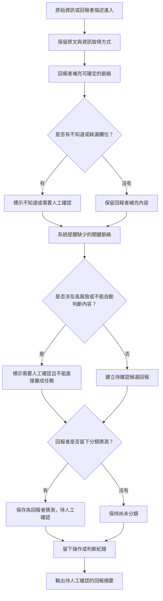

# 資訊流程設計

> AI 草稿，待人類確認：這份流程依照 `release-packs/02-flow-design-kit/` 產生，目標是支撐 v1 prototype 設計，不代表正式救災流程。

## 我的 v1 目標

- 我優先服務的使用者：回報者。
- 這個使用者最想完成的事：把自己知道的原始資訊誠實、有效率但細心地留下來，讓後續整理者比較好判斷。
- 我最想避免的錯誤：把轉述、不完整描述、回報者猜測或 AI 提醒顯示成已確認事實、正式分類或可直接行動的任務。

## 自然語言流程描述

```text
回報者從 Phase 0 原始資訊或一段新的原始描述開始。
系統先保留原文，不把內容改寫成確定語氣。

回報者補充自己能確定的脈絡，例如是否親眼確認、是否為轉述、大概時間、地點線索、需求類型與是否仍有效。
如果回報者不知道某個欄位，可以標示為不知道或需要人工確認，不能為了送出而亂猜。

系統可以提醒缺少哪些關鍵脈絡，但 AI 或規則只能當提醒者，不能替回報者判斷資訊是否為真，也不能替回報者決定是否派工、通報或交給哪個單位。

如果內容涉及道路封閉、醫療藥品、公開地址、個資、當事人同意、現場安全、相互矛盾資訊，或回報者不是當事人，流程必須標示為需要人工確認。

如果回報者留下「可能由志工協助」或「可能需要政府或專責單位」這類分類，只能保存為回報者猜測，不能顯示成已確認分類。

送出後，系統建立一筆待人工確認的候選回報，顯示原文、補充欄位、缺漏欄位、提醒與回報者猜測。
後續整理者檢查前，這筆資訊不能直接變成任務。

每次回報者送出、修改、標示不知道、採用或忽略提醒、留下分類猜測，都要留下操作或判斷紀錄，方便下一位協作者知道誰做了什麼判斷與為什麼。
```

## Mermaid 流程圖

請用 VS Code 預覽，確認流程圖能正常顯示。



## 人工確認點

- 回報者是否親眼確認、轉述他人，或代替當事人回報。
- 地點、時間、需求、數量、現場安全與資訊是否仍有效。
- 是否涉及道路封閉、醫療藥品、公開地址、個資、當事人同意或官方權責。
- 回報者留下的「可能由志工協助」或「可能需要政府或專責單位」是否能成為後續分類。
- 相互矛盾或過期資訊是否要暫時保留、退回補充，或交給整理者後續查核。

## 不能自動處理的分支

- AI 或規則不能自動判斷資訊是否為真。
- AI 或規則不能自動決定派工、官方通報、救災優先順序或建立正式任務。
- 回報者不知道的欄位不能被自動補完，只能標為不知道或需要人工確認。
- 涉及醫療、道路安全、個資、當事人同意、公開地址或現場安全時，不能直接輸出成可行動任務。
- `sourceType` 不能被當成可信度或官方背書，只能表示資訊取得方式。

## 操作或判斷紀錄

- 回報者送出或修改原始描述。
- 回報者標示自己是親眼確認、轉述、代替當事人回報，或不知道。
- 系統提醒缺少關鍵脈絡時，回報者採用、忽略或補充的選擇。
- 回報者留下分類猜測時，紀錄它只是猜測，待人工確認。
- 系統標示「需要人工確認」或「不能直接變成任務」時，紀錄觸發原因。

## 我檢查後修正了什麼

- 原本：流程可能在「內容足夠」後直接建立候選結果，容易讓人誤以為候選結果已經可用。
- 修正後：所有輸出都寫成「待人工確認的候選回報」，並明確標示高風險內容不能直接變成任務。
- 為什麼：`docs/design-checklist.md` 要求流程不能把未確認資訊直接當成已確認，也不能讓 AI 自動決定救災、派工或行動優先順序。

## 我仍不確定的流程點

- 回報表單哪些欄位必填，哪些只用提醒鼓勵補充。
- 「我親眼確認」「我聽別人說」「我代替當事人回報」是否需要允許多選。
- 是否要保留「你覺得可能要交給誰？」這個分類猜測欄位，或改問更保守的風險項目。
- AI 提醒是否只顯示缺漏欄位，還是允許產生「待確認摘要」。
- 回報完成畫面是否要提供補充資訊入口，以及如何避免它看起來像救災承諾。
